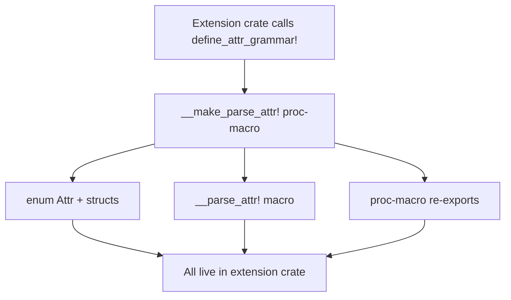
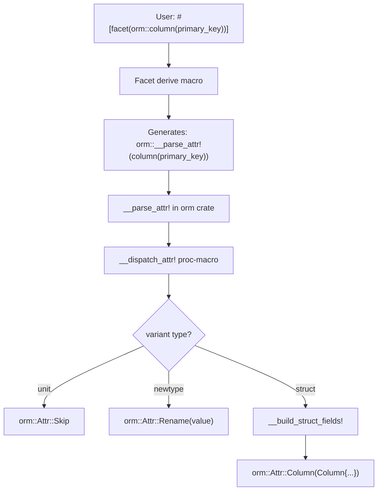
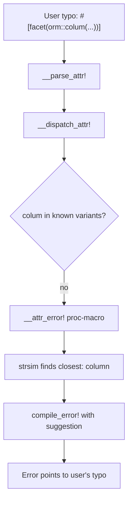
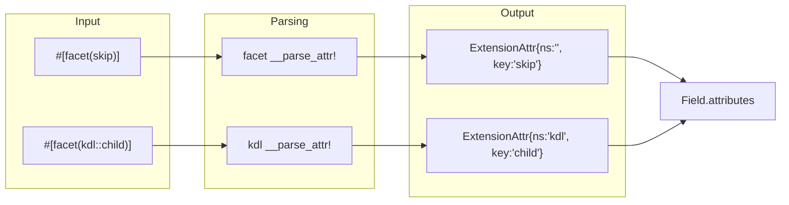
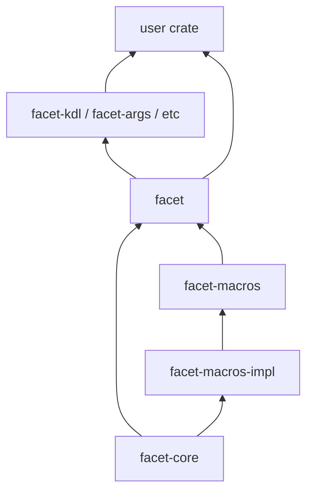
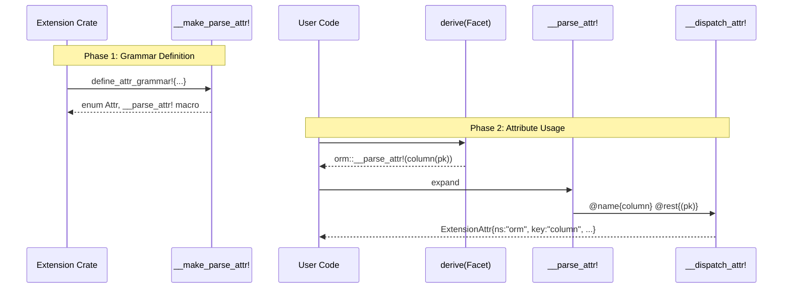

# Extension Attributes Architecture Diagrams

Render with: https://mermaid.live or VS Code Mermaid extension

---

## Diagram 1: Grammar Definition Time

**What each box means:**
- `define_attr_grammar!` — user-facing macro in extension crate (e.g., facet-kdl)
- `__make_parse_attr!` — proc-macro in facet-macros that compiles the grammar
- `enum Attr + structs` — the type definitions for parsed attributes
- `__parse_attr!` — declarative macro containing the compiled grammar patterns
- `proc-macro re-exports` — `__dispatch_attr`, `__build_struct_fields`, `__attr_error`

---

## Diagram 2: Attribute Usage Flow

---

## Diagram 3: Error Flow

---

## Diagram 4: Storage Model

**Key insight:** Both built-in (`ns: ""`) and extension (`ns: "kdl"`) attrs become `ExtensionAttr`.

---

## Diagram 5: Crate Dependencies

---

## Diagram 6: Sequence

