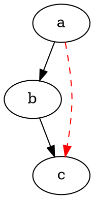

Code-fence injection demo.

Prose between fences stays plain. Each fenced block below is parsed and
highlighted by its OWN language grammar, injected into this host grammar:

```json
{ "name": "Ada Lovelace", "born": 1815, "tags": ["math", "computing"], "ok": true }
```

```graphql
type Query {
  hero(episode: Episode): Character
  human(id: ID!): Human
}
```



Three languages highlighted in one document, via Snark's injection layering.
